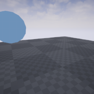

# UE4-HighScore

1. Create `RebuildProject` is C++ Empty Project
2. Unzip [JSONQuery](https://forums.unrealengine.com/showthread.php?7045-JSON-Query) in `RebuildProject/Plugins`
3. Rebuild JSONQuery
4. Move JSONQuery to `UE4-HighScore/Plugins/JSONQuery`
5. Boot the HighScoreServer using `./Server/server.coffee` after `npm install`
6. Play the UE4-Highscore
7. Put random score to HighScoreServer if Press `z` key
